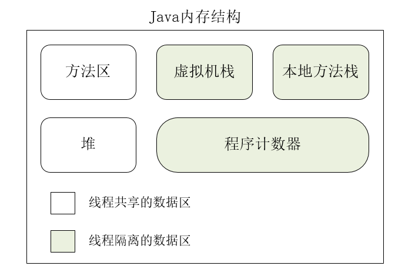
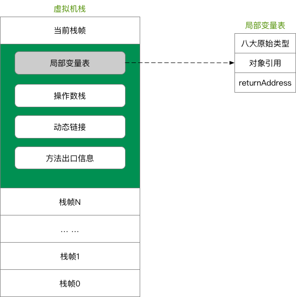

# JVM内存结构

Java 虚拟机的内存空间分为 5 个部分： 

- 程序计数器（PC）
- 虚拟机栈
- 本地方法栈
- 方法区
- 堆

## 程序计数器

### 定义

程序计数器是一块较小的内存空间，是当前线程正在执行的那条字节码指令的地址的指示器。

### 作用

-  字节码解释器通过改变程序计数器来依次读取指令，从而实现代码的流程控制。 
-  在多线程情况下，程序计数器记录的是当前线程执行的位置，从而当线程切换回来时，就知道上次线程执行到哪了。 

### 特点

- 是一块较小的内存空间。 
- 线程私有，每条线程都有自己的程序计数器。 
- 生命周期：随着线程的创建而创建，随着线程的结束而销毁。 
- 是唯一一个不会出现`OutOfMemoryError`的内存区域。 
- 如果线程执行的是 Java 方法，PC 是正在执行的字节码指令的地址；如果是 Native 方法，PC为` Undefined `

## 虚拟机栈

### 定义

 Java 虚拟机栈是描述 Java 方法执行的内存模型。 

 Java 虚拟机栈会为每一个即将运行的 Java 方法创建一块叫做“栈帧”的区域，用于存放该方法运行过程中的一些信息，如： 

- 局部变量表（8个基本类型，对象引用[referrence类型]，returnAddress类型[指向字节码指令地址]）
- 操作数栈
- 动态链接
- 方法出口
- ..........

### 压栈出栈过程

当方法运行过程中需要创建局部变量时，就将局部变量的值存入栈帧中的局部变量表中。

Java 虚拟机栈的栈顶的栈帧是当前正在执行的活动栈，也就是当前正在执行的方法，PC 寄存器也会指向这个地址。只有这个活动的栈帧的本地变量可以被操作数栈使用，当在这个栈帧中调用另一个方法，与之对应的栈帧又会被创建，新创建的栈帧压入栈顶，变为当前的活动栈帧。

方法结束后，当前栈帧被移出，栈帧的返回值变成新的活动栈帧中操作数栈的一个操作数。如果没有返回值，那么新的活动栈帧中操作数栈的操作数没有变化。

### 特点

- 64位长度的 long 和 double 类型的数据会占用 2 个局部变量空间（slot），其余数据类型只占 1 个
- 局部变量表所需的内存空间在编译期间完成分配，即栈帧分配的局部变量空间是完全确定的，在方法运行期间不会改变局部变量表的大小
- Java 虚拟机栈会出现两种异常：StackOverFlowError 和 OutOfMemoryError。
  - StackOverFlowError 若 Java 虚拟机栈的大小不允许动态扩展，那么当线程请求栈的深度超过当前 Java 虚拟机栈的最大深度时，抛出 StackOverFlowError 异常。
  - OutOfMemoryError 若允许动态扩展，那么当线程请求栈时内存用完了，无法再动态扩展时，抛出 OutOfMemoryError 异常。

- Java 虚拟机栈也是线程私有，随着线程创建而创建，随着线程的结束而销毁。 

## 本地方法栈

- 本地方法栈与虚拟机栈的作用是非常相似的，区别在于虚拟机栈为虚拟机执行Java方法（字节码）服务，而本地方法栈则为虚拟机用到的Native方法服务。

- 有些虚拟机（如Sun HotSpot）直接把本地方法栈和虚拟机栈合并
- 本地方法栈也会有两种异常：StackOverFlowError 和 OutOfMemoryError
- 是线程私有的

## 堆

### 定义

Java堆是被所有线程共享的一块内存区域，在虚拟机启动时创建。目的是存放对象实例，**几乎所有**的对象实例都在这里分配内存。

Java虚拟机规范中描述：所有对象实例和数组在堆上分配，但是随着JIT编译器发展和逃逸分析技术成熟，栈上分配、标量替换优化技术会导致一些变化，所作对象在堆上分配也不是那么绝对。

### 特点

- 是垃圾回收管理的主要区域
- 从内存回收角度看，由于现在收集器基本采用分代算法，Java堆空间可细分为：新生代与老生代。新生代还可以进一步细化为 Eden空间、From Survivor空间、To Survivor空间。
- 从内存分配角度看，Java堆中可能划分线程私有的分配缓冲区（Thread Local Allocation Buffer，TLAB）

- Java堆可以处于物理不连续的物理空间，只要逻辑连续就行
- 可以用过`-Xmx和-Xms`控制堆的大小，如果堆中内存不够，无法完成分配且无法拓展是，会抛出 OutOfMemoryError 异常

## 方法区

 Java 虚拟机规范中定义方法区是堆的一个逻辑部分，是线程共享的内存区域。方法区存放以下信息： 

- 被虚拟机加载的类信息
- 常量
- 静态变量
- 即时编译器编译后的代码

很多人将方法区成为“永久代”，  因为方法区中的信息一般需要长期存在。但实际上两者并不等价。

Java虚拟机规范对方法区的限制非常宽松，除了和 Java堆一样不需要连续的内存空间和可以选择固定大小或可扩展外，还可以选择不实现垃圾回收。

垃圾回收行为在这个区域比较少出现，**该区域的回收目标主要是针对常量池的回收和对类型的卸载。**

这个区域的回收成绩比较令人难以满意，尤其是类型的卸载，条件非常苛刻。

对于 HotSpot虚拟机，现在也有放弃永久代并逐步改为采用 Native Memory 来实现方法区的规划。**目前在 JDK1.7中，已经把原本放在方法区的字符串常量池移除。**

### 运行时常量池

- 运行时常量池是方法区的一部分
- Class文件除了有类的版本、字段、方法、接口等描述信息外，还有常量池，用于存放编译期生成的各种字面量和符号引用，这部分内容将在类加载后进入方法区的运行时常量池中存放。
- Java虚拟机规范没有对运行时常量池有细节要求，一般来说，除了保存 Class文件中描述的符号引用外，还会把编译出来的直接引用也存储在运行时常量池中。
- 运行时常量池相比 Class文件常量池的重要特征就是具备动态性。并非预置入Class文件中常量池才能进入方法区运行时常量池，运行期间也可以将新的常量放入池中，如`String.intern()`方法
- 运行时常量池在无法申请内存时也会抛出 OutOfMemoryError 异常

## 直接内存

- 直接内存是除 Java 虚拟机之外的内存，但也可能被 Java 使用。它不是虚拟机运行时数据区的一部分，也不是 Java虚拟机规范规定的内存区域。

- 在 JDK1.4中加入了 NIO类，引入一种基于通道（Channel）与缓冲区（Buffer）的 I/O方式，可以使用 Native函数库直接分配堆外内存，然后通过一个存储在 Java堆中的 DirectByteBuffer对象作为这块内存的引用进行操作。避免了 Java堆和 Native堆中来回复制数据，提高了性能。

-  直接内存的大小不受 Java 虚拟机控制，但既然是内存，当内存不足时就会抛出 OutOfMemoryError 异常。 

