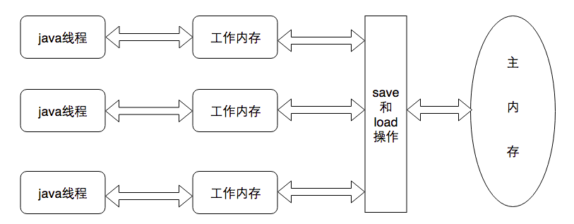

# Java 内存模型

Java 虚拟机定义了一种 Java 内存模型（JMM）来屏蔽各种硬件与操作系统的内存访问差异，使得不同平台能达到一致的内存访问效果。

## 主内存与工作内存

Java 内存模型的主要目标是定义程序中各个变量的访问规则，即在虚拟机中将变量存储到内存和从内存中读取变量的底层细节。这里的变量包括实例字段、静态字段和构成数组对象的元素，但不包括局部变量和方法参数，因为后者是线程私有的，不会被共享，不会有竞争问题。

Java 内存模型规定所有的变量都存储在主内存（Main Memory）中，每条线程还有自己的工作内存（Working Memory）。

- 线程的工作内存保存了被该线程使用到的变量的主内存副本拷贝，线程对变量的所有操作（赋值、读取等）都必须在工作内存中进行，不能直接读写主内存中的变量。
- 不同线程无法访问对方的工作内存的变量，线程间变量值的传递需要通过主内存完成。



从变量与内存定义来看，主内存主要对应 Java 堆中的实例对象数据部分；而工作内存对应虚拟机栈中的部分区域。

## 内存间交互

Java 内存模型规定8种操作来完成内存交互，且每一种操作都是原子的、不可分割的 （对于 double 和 long 有例外） 。操作如下：

- lock：作用于主内存变量，将变量标识为一条线程独占的状态。
- unlock：作用于主内存变量，将处于锁定状态的变量释放出来。
- read：作用于主内存变量，它把变量的值从主内存传输到线程工作内存中，以便 load 使用。
- load：作用于工作内存变量，它把 read 操作从主内存中得到的变量值放入工作内存的变量副本中。
- use：作用于工作内存变量，将工作内存的变量传递给执行引擎。
- assign：作用于工作内存变量，它把从执行引擎接收到的值赋给工作内存的变量。
- store：作用于工作内存变量，它把工作内存的变量值传送到主内存，以便 write 使用。
- write：作用于主内存变量。它把 store 操作从工作内存中得到的变量值放入主内存的变量中。

如果把一个变量从主内存复制到工作内存，需要顺序执行 read 和 load 操作；如果要把变量从工作内存同步回主内存，需要顺序执行 store 和 write 操作。Java 内存模型只规定了上面两个操作要按顺序执行，但没保证是连续执行。

Java 内存模型规定了以下操作规则：

- 不允许 read 和 load、store 和 write 之一单独出现。即不允许变量从主内存读取了但是工作内存不接受，或者工作内存写回了但主内存不接受的情况。
- 不允许线程丢弃最近的 assign 操作，即变量在工作内存中改变了之后必须把改变化同步回主内存。
- 不允许线程无原因地（没发生 assign 操作）把数据从工作内存同步回主内存。
- 一个新的变量只能在主内存诞生，即对变量实施 use、store 之前必须先执行 load、assign 操作。
- 一个变量同一时刻只允许被一条线程 lock，但 lock 操作可被同一线程多次执行。
- 执行 lock 操作会清空工作内存此变量的值，在使用该变量之前，需要重新执行 load、assign 等初始化操作。
- 一个变量 unlock 之前，必须将变量同步回主内存中。即执行 store、write 操作。

## volatile 变量的特殊规则

当一个变量被 volatile 修饰后，将具备两个特性：可见性与禁止指令重排序优化。

### 可见性

保证此变量对所有线程的可见性，可见性指的是当一条线程修改了这个变量的值，新值对于其他线程是可以立即得知的。

volatile 变量在各个线程的工作内存中不存在一致性问题，但是 Java 里面的运算并非原子性操作，因此 volatile 变量的运算在并发下一样是不安全的。

在不符合以下两条规则的场景中，仍然需要加锁来保证原子性：

- 运算结果不依赖变量当前的值，或者确保只有单一线程修改变量的值
- 变量不需要与其他的状态变量共同参与不变约束

### 禁止指令重排序优化

普通的变量仅仅会保证在该方法执行的过程中，所有依赖赋值结果的地方都能获取到正确的结果，但不能保证变量赋值的操作顺序和程序代码的顺序一致。因为在一个线程的方法执行过程中无法感知到这一点，这也就是 java 内存模型中描述的所谓的“线程内部表现为串行的语义”。

也就是在单线程内部，我们看到的或者感知到的结果和代码顺序是一致的，即使代码的执行顺序和代码顺序不一致，但是在需要赋值的时候结果也是正确的，所以看起来就是串行的。但实际结果有可能代码的执行顺序和代码顺序是不一致的。这在多线程中就会出现问题。

看下面的伪代码举例：

```
Map configOptions;
char[] configText;
//volatile类型bianliang
volatile boolean initialized = false;

//假设以下代码在线程A中执行
//模拟读取配置信息，读取完成后认为是初始化完成
configOptions = new HashMap();
configText = readConfigFile(fileName);
processConfigOptions(configText, configOptions);
initialized = true;

//假设以下代码在线程B中执行
//等待initialized为true后，读取配置信息进行操作
while ( !initialized) {
  sleep();
}
doSomethingWithConfig();
```

如果initialiezd是普通变量，没有被volatile修饰，那么线程A执行的代码的修改初始化完成的结果 `initialized = true` 就有可能先于之前的三行代码执行，而此时线程B发现initialized为true了，就执行 `doSomethingWithConfig()` 方法，但是里面的配置信息都是null的，就会出现问题了。

现在initialized是volatile类型变量，保证禁止代码重排序优化，那么就可以保证 `initialized = true` 执行的时候，前边的三行代码一定执行完成了，那么线程B读取的配置文件信息就是正确的。

跟其他保证并发安全的工具相比，volatile 的性能确实会好一些。在某些情况下，volatile 的同步机制性能要优于锁（使用 synchronized 关键字或者 java.util.concurrent 包中的锁）。但是现在由于虚拟机对锁的不断优化和实行的许多消除动作，很难有一个量化的比较。

与自己相比，就可以确定一个原则：volatile 变量的读操作和普通变量的读操作几乎没有差异，但是写操作会性能差一些，慢一些，因为要在本地代码中插入许多内存屏障指令来禁止指令重排序，保证处理器不发生代码乱序执行行为。

### 总结

Java 内存模型对 volatile 专门定义了一些特殊的访问规则：

- **只有当线程 T 对变量V执行的前一个动作是 load，线程 T 对变量 V 才能执行 use 动作；同时只有当线程 T 对变量 V 执行的后一个动作是 use 的时候线程 T 对变量 V 才能执行 load 操作。**所以，线程 T 对变量 V 的 use 动作和线程 T 对变量 V 的 read、load 动作相关联，必须是连续一起出现。也就是在线程 T 的工作内存中，每次使用变量 V 之前必须从主内存去重新获取最新的值，用于保证线程 T 能看得见其他线程对变量V的最新的修改后的值。
- **只有当线程 T 对变量 V 执行的前一个动作是 assign 的时候，线程T对变量 V 才能执行 store 动作；同时只有当线程 T 对变量 V 执行的后一个动作是 store 的时候，线程 T 对变量 V 才能执行 assign 动作。**所以，线程 T 对变量 V 的 assign 操作和线程 T 对变量 V 的 store、write 动作相关联，必须一起连续出现。也即是在线程 T 的工作内存中，每次修改变量 V 之后必须立刻同步回主内存，用于保证线程 T 对变量 V 的修改能立刻被其他线程看到。
-  假定动作 A 是线程 T 对变量 V 实施的 use 或 assign 动作，动作 F 是和动作 A 相关联的 load 或 store 动作，动作 P 是和动作 F 相对应的对变量 V 的 read 或 write 动作；类似的，假定动作 B 是线程 T 对变量 W 实施的 use 或 assign 动作，动作 G 是和动作 B 相关联的 load 或 store 动作，动作 Q 是和动作 G 相对应的对变量 W 的 read 或 write 动作。如果动作 A 先于 B，那么 P 先于 Q。**也就是说在同一个线程内部，被 volatile 修饰的变量不会被指令重排序，保证代码的执行顺序和程序的顺序相同。**

## long 与 double 型变量特殊规则

Java 内存模型要求对主内存和工作内存交换的八个动作是原子的，但对 long 和 double 有一些特殊规则。八个动作中 lock、unlock、read、load、use、assign、store、write 对待 32 位的基本数据类型都是原子操作，对待 long 和 double 这两个 64 位的数据，java 虚拟机规范对 java 内存模型的规定中特别定义了一条相对宽松的规则：

- 允许虚拟机将没有被 volatile 修饰的 64 位数据的读写操作划分为两次 32 位的操作来进行，也就是允许虚拟机不保证对 64 位数据的 read、load、store 和 write 这 4 个操作的原子性。这也就是我们常说的 long 和 double 的非原子性协定。

但虚拟机建议将 long、double 变量实现为原子操作。实际上大部分商用虚拟机也是这样实现的，因此不需要将 long、double 变量声明为 volatile。

## Java 内存模型特征

### 原子性

由 Java 内存模型来直接保证原子性的变量操作包括 read、load、use、assign、store、writ e这6个动作。虽然存在 long 和 double 的特例，但基本可以忽律不计，目前虚拟机基本都对其实现了原子性。

如果需要更大范围的控制，lock 和 unlock 也可以满足需求。lock 和 unlock 虽然没有被虚拟机直接开给用户使用，但是提供了字节码层次的指令 monitorenter 和 monitorexit 对应这两个操作，对应到 java 代码就是 synchronized 关键字，因此在 synchronized 块之间的代码都具有原子性。

### 可见性

可见性是指一个线程修改了一个变量的值后，其他线程立即可以感知到这个值的修改。正如前面所说，volatile 类型的变量在修改后会立即同步给主内存，在使用的时候会从主内存重新读取，是依赖主内存为中介来保证多线程下变量对其他线程的可见性的。

除了 volatile，synchronized 和 final 也可以实现可见性。

- synchronized 关键字是通过 unlock 之前必须把变量同步回主内存来实现的。
- final 则是在初始化后就不会更改，所以只要在初始化过程中没有把 this 指针传递出去也能保证对其他线程的可见性。

### 有序性

有序性从不同的角度来看是不同的。单纯单线程来看都是有序的，但到了多线程就会跟我们预想的不一样。可以这么说：如果在本线程内部观察，所有操作都是有序的；如果在一个线程中观察另一个线程，所有的操作都是无序的。前半句说的就是 “线程内表现为串行的语义” ，后半句指的是 “指令重排序” 现象和主内存与工作内存之间同步存在延迟的现象。

保证有序性的关键字有 volatile 和 synchronized ，volatile 禁止了指令重排序，而 synchronized 则由一个变量在同一时刻只能被一个线程对其进行 lock 操作来保证。

总体来看，synchronized 对三种特性都有支持，虽然简单，但是如果无控制的滥用对性能就会产生较大影响。

## 先行发生原则

如果 Java 内存模型中所有的有序性都要依靠 volatile 和 synchronized 来实现，那是不是非常繁琐。Java 语言中有一个 “先行发生原则” ，是判断数据是否存在竞争、线程是否安全的主要依据。 

先行发生原则是 Java 内存模型中定义的两个操作之间的偏序关系。比如说操作 A 先行发生于操作 B，那么在 B 操作发生之前，A 操作产生的 “影响” 都会被操作 B 感知到。这里的影响包括修改了内存中的共享变量、发送了消息、调用了方法等。

Java 虚拟机有一些 “天然的” 先行发生关系，这些先行发生关系无须任何同步器协助就已经存在，可在编码直接使用。如果两个操作的关系不在此列，虚拟机可以随意地进行重排序。关系如下：

- 程序次序原则：在一个线程内部，按照代码的顺序，书写在前面的先行发生与后边的。或者更准确的说是在控制流顺序前面的先行发生与控制流后面的，而不是代码顺序，因为会有分支、跳转、循环等。 
- 管程锁定规则：一个unlock操作先行发生于后面对同一个锁的 lock 操作。这里必须注意的是对同一个锁，后面是指时间上的后面 。
- volatile 变量规则：对一个 volatile 变量的写操作先行发生与后面对这个变量的读操作，这里的后面是指时间上的先后顺序。
- 线程启动规则：Thread 对象的 `start()` 方法先行发生与该线程的每个动作。当然如果你错误的使用了线程，创建线程后没有执行start 方法，而是执行run方法，那此句话是不成立的，但是如果这样其实也不是线程了。
- 线程终止规则：线程中的所有操作都先行发生与对此线程的终止检测，可以通过 `Thread.join()` 和 `Thread.isAlive()` 的返回值等手段检测线程是否已经终止执行。
- 线程中断规则：对线程 `interrupt()` 方法的调用先行发生于被中断线程的代码检测到中断事件的发生，可以通过 `Thread.interrupted()` 方法检测到是否有中断发生。
- 对象终结规则：一个对象的初始化完成先行发生于他的 finalize 方法的执行，也就是初始化方法先行发生于 finalize 方法。
- 传递性：如果操作 A 先行发生于操作 B，操作 B 先行发生于操作 C，那么操作 A 先行发生于操作 C。

时间先后顺序与先行发生原则之间基本没有太大的关系，所以我们衡量并发安全问题的时候不要受到时间顺序的干扰，一切必须以先行发生原则为准。 