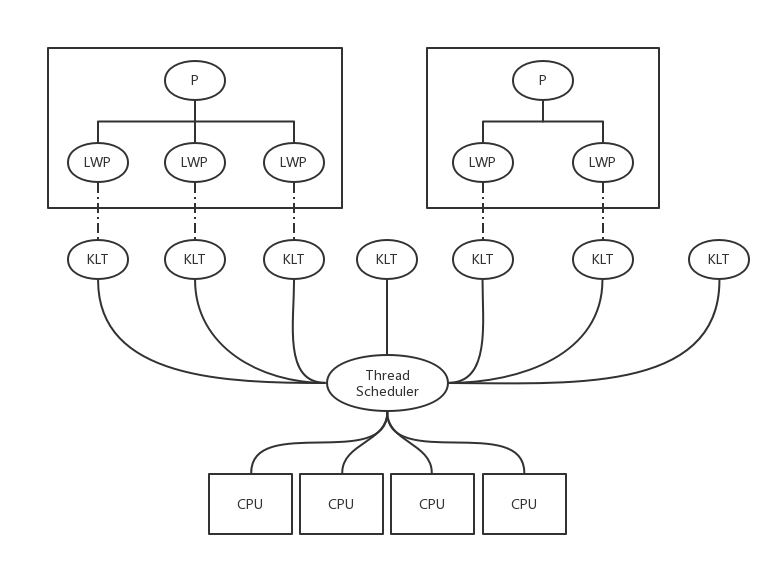
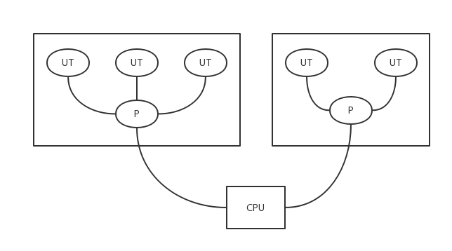
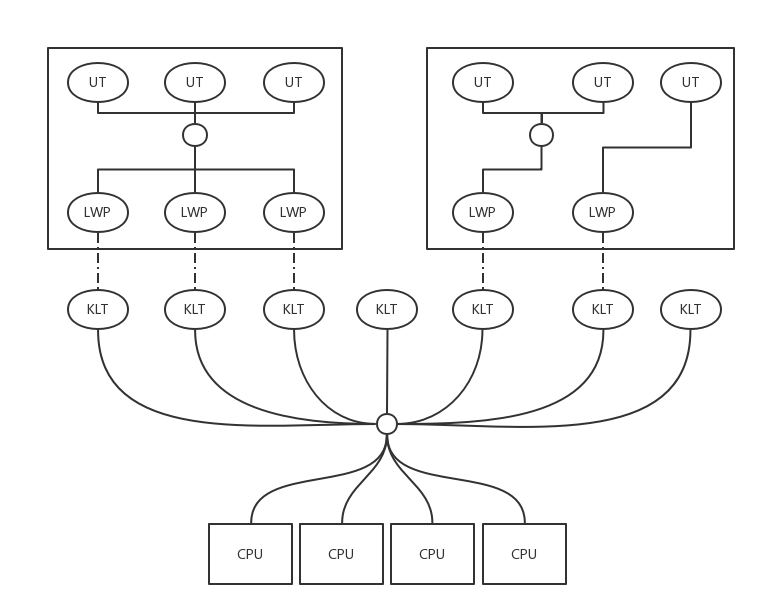
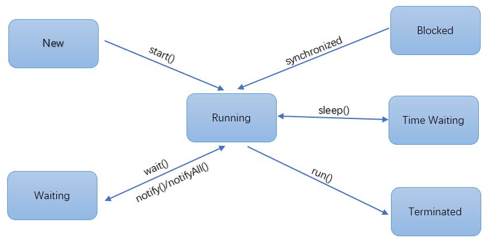

# Java 线程

## 线程的实现

实现线程的方式主要有 3 种：使用内核线程实现、使用用户线程实现、使用用户线程加轻量级进程混合实现。

### 内核线程实现

内核线程（Kernel Level Thread，KLT）直接由操作系统内核支持的线程，由系统内核完成线程切换。系统内核通过调度器（Scheduler）对线程进行调度，并将线程的任务映射到各个处理器上。每个内核线程可以视为内核的一个分身，这样操作系统就有能力同时处理多件事情，支持多线程的内核就叫做多线程内核（Multi-Threads Kernel）。 

程序一般不会直接去使用内核线程，而是去使用内核线程的一种高级接口——轻量级进程（Light Weight Process，LWP），轻量级进程就是我们通常意义上所讲的线程，由于每个轻量级进程都由一个内核线程支持，因此只有先支持内核线程，才能有轻量级进程。这种轻量级进程与内核线程之间1:1的关系称为一对一的线程模型，如下图所示：

由于内核线程的支持，每个轻量级进程都成为了一个独立的调度单元，即使有一个轻量级进程在系统调用中阻塞了，也不会影响整个进程继续工作，但是轻量级进程有它的局限性：

- 首先，由于是基于内核线程实现的，所以各种线程操作，如创建、析构和同步，都需要进行系统调用。而系统调用的待嫁相对较高，需要在用户态和内核态中来回切换。
- 其次，每个轻量级进程都需要有一个内核线程的支持，因此轻量级进程要消耗一定的内核资源（如内核线程的栈空间），因此一个系统支持轻量级进程的数量是有限的。

### 用户线程实现

从广义上讲，一个线程只要不是内核线程，就可以认为是用户线程，因此从这个定义上来讲，轻量级进程也属于用户线程，但轻量级进程的实现始终是建立在内核之上的，许多操作都要进行系统代用，效率会受到限制。

而狭义的用户线程指的是完全建立在用户空间的线程库上，系统内核不能感知线程存在的实现。用户线程的创建、同步、销毁和调度完全在用户状态中完成，不需要内核的帮助。如果程序实现得当，这种线程不需要切换到内核态，因此操作可以是非常快速且低消耗的，也可以支持规模更大的线程数量，部分高性能数据库中的多线程就是由用户线程实现的。这种线程与用户线程之间 1：N 的关系称为一对多的线程模型，如图所示

使用用户线程的优势在于不需要系统内核支援，劣势也在于没有系统内核的支援，所有的线程操作都需要用户程序自己处理。线程的创建、切换和调度都是需要考虑的问题，而且由于操作系统只把处理器资源分配到进程，那 “阻塞如何处理” 、“多处理器系统中如何将线程映射到其他处理器上” 这类问题解决起来就会异常困难，甚至不可能完成。

因而使用用户线程实现的程序一般都比较复杂，除了以前在不支持多线程的操作系统中的多线程和少数特殊需求的程序外，现在使用用户线程的程序越来越少，Java、Ruby 等语言都曾经使用过用户线程，但最终又都放弃了。

### 用户线程加轻量级进程混合实现

在这种混合实现下，既存在用户线程，也存在轻量级进程。用户线程还是完全建立在用户空间中，因此用户线程的创建、切换、析构等操作依然廉价，并且可以支持大规模的用户线程并发。而操作系统提供支持的轻量级进程则作为用户线程和内核线程之间的桥梁，这样可以使用内核提供的线程调度功能及处理器映射，并且用户线程的系统调度要通过轻量级进程来完成，大大降低了整个进程被阻塞的风险。

在这种混合模式中，用户线程与轻量级进程的数量比是不一定的，即为 N：M 的关系。许多UNIX系列的操作系统都提供了 N：M 的线程模型实现。

### Java 线程实现

Java 线程在 JDK1.2 之前，是基于称为“绿色线程”的用户线程实现的，而在 JDK1.2 中，线程模型替换成基于操作系统原生线程模型来实现。因此在目前的 JDK 版本中，操作系统支持怎样的线程模型，在很大程度上决定了 Java 虚拟机的线程是怎样的映射，这点不同平台没有办法达成一致，虚拟机规范中也并未限定 Java 线程需要使用哪些线程模型来实现。线程模型只对线程的并发规模和操作成本产生影响，对 Java 程序的编码和运行过程来说，这些差异都是透明的。

对于 Sun JDK 来说，它的 Windows 版和 Linux 版都是使用一对一的模型实现的，一条 Java 线程就映射到一条轻量级进程中，因为 Windows 和 Linux 系统提供的线程模型就是一对一的。

但是在 Solaris 平台，由于操作系统的线程特性可以同时支持一对一和多对多的线程模型，因此 在Solaris 版的 JDK 也对应提供了两个平台专有的的虚拟机参数：-XX:UseLWPSynchronization（默认值）和-XX:UseBoundThreads 来明确指定虚拟机适用哪种线程模型。

## Java 线程调度

线程调度是指系统为线程分配处理器使用权的过程，主要调度方式有两种，分别是协同式线程调度（Cooperative ）和抢占式线程调度（Preemptive Threads-Scheduling）。 

- 如果使用协同式调度的多线程系统，线程的执行时间由线程本身来控制，线程把自己的工作执行完了之后，要主动通知系统切换到另外一个线程上。 
- 如果使用抢占式调度的多线程系统，那么每个线程将由系统来分配执行时间，线程的切换不由线程本身来决定（在 Java 中，Thread.yield() 可以让出执行时间，但是要获取执行时间的话，线程本身是没有什么办法的）。在这种实现线程调度的方式下，线程的执行时间是系统可控的，也不会有一个线程导致整个进程阻塞的问题，**Java使用的线程调度方式就是抢占式调度。**

Java 线程调度是系统自动完成的，但是我们可以设置线程优先级来影响调用的情况。不过优先级并不一定能起到作用。

## 线程状态转换

Java中定义了5种线程状态，在任意一个时间点，一个线程只能有且仅有一种状态，如下：

- 新建（New）：创建后尚未启动的线程
- 运行（Runable）：Runable 包括了操作系统线程状态中的 Running 和 Ready，也就是处于此状态的线程有可能正在执行，也有可能正在等待 CPU 为它分配执行时间。
- 无限等待（Waiting）：处于这种状态的线程不会被分配 CPU 执行时间，它们要等待被其他线程显式的唤醒。以下方法会让线程陷入无限等待状态： 
  - 没有设置 Timeout 参数的 Object.wait() 方法
  - 没有设置 Timeout 参数的 Thread.join() 方法
  - LockSupport.park() 方法
- 限期等待（Timed Waiting）：处于这种状态的线程也不会被分配 CPU 执行时间，不过无须等待被其他线程显示的唤醒，在一定时间后它们会由系统自动唤醒。以下方法会让线程进入限期等待状态： 
  - Thread.sleep() 方法
  - 设置了 Timeout 参数的 Object.wait() 方法
  - 设置了 Timeout 参数的 Thread.join() 方法
  - LockSupport.parkNanos() 方法
  - LockSupport.parkUnit() 方法
- 阻塞（Blocked）：线程被阻塞了，“阻塞状态” 和 “等待状态” 的区别在于：“阻塞状态”  在等待着获取到一个排他锁，这个时间将在另外一个线程放弃这个锁的时候发生；而“等待状态”则是在等待一段时间，或者唤醒动作的发生。在程序等待进入同步区域的时候，线程将进入这种状态。
- 结束（Terminated）：已终止线程的线程状态，线程已经结束执行。

