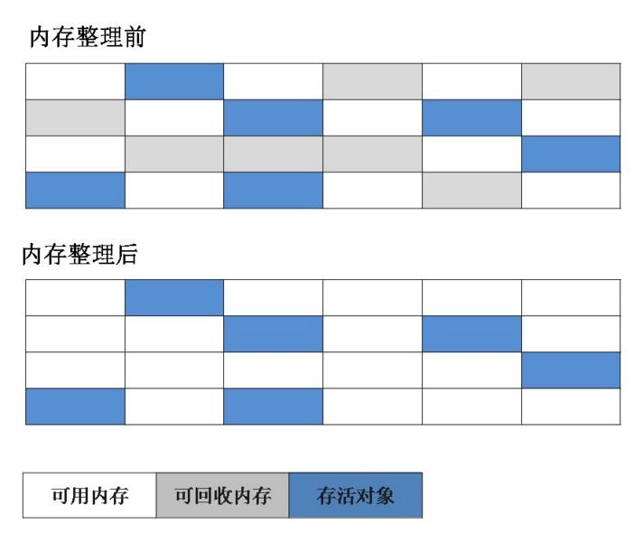
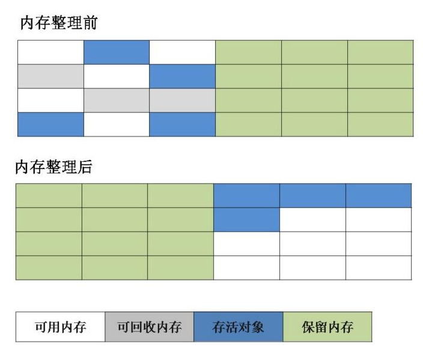
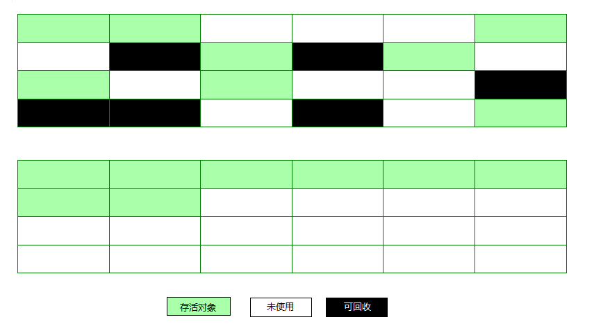

# 垃圾收集策略与算法

程序计数器、虚拟机栈、本地方法栈随线程而生，也随线程而灭；栈帧随着方法的开始而入栈，随着方法的结束而出栈。这几个区域的内存分配和回收都具有确定性，在这几个区域内不需要过多考虑回收的问题，因为方法结束或者线程结束时，内存自然就跟随着回收了。

而对于 Java 堆和方法区，我们只有在程序运行期间才能知道会创建哪些对象，这部分内存的分配和回收都是动态的，垃圾收集器所关注的正是这部分内存。

## 判断对象是否存活

垃圾收集器对内存进行回收之前，要检查对象是 “存活” 还是 “死去”，对 “死去” 的对象需要进行内存回收。

### 引用计数法

在对象头维护着一个 counter 计数器，对象被引用一次则计数器 +1；若引用失效则计数器 -1。当计数器为 0 时，就认为该对象无效了，不可能再次被使用。 

引用计数算法的实现简单，判定效率也很高，在大部分情况下它都是一个不错的算法。但是主流的 Java 虚拟机里没有选用引用计数算法来管理内存，主要是因为它很难解决对象之间循环引用的问题。 

> 如对象 objA 和 objB 都有字段 instance，令 objA.instance = objB 并且 objB.instance = objA，由于它们互相引用着对方，导致它们的引用计数都不为 0，于是引用计数算法无法通知 GC 收集器回收它们。 

### 可达性分析法

通过一系列为 GC Roots 的对象作为起始点，从这些节点开始向下搜索，搜索所走过的路径称为引用链，当一个对象到 GC Roots 没有任何引用链相连时，则证明该对象是不可用的。 

可作为 GC Roots 的对象包括：

- Java 虚拟机栈（栈帧中的本地变量表）中引用的对象
- 方法区中类静态属性引用的对象
- 方法区中常量引用的对象
- 本地方法栈中 JNI（即 Native方法）引用的对象

GC Roots 并不包括堆中对象所引用的对象，这样就不会有循环引用的问题。 

## 引用的种类

判定对象是否存活与“引用”有关。在 JDK 1.2 以前，Java 中的引用定义很传统，一个对象只有被引用或者没有被引用两种状态，我们希望能描述这一类对象：当内存空间还足够时，则保留在内存中；如果内存空间在进行垃圾收集后还是非常紧张，则可以抛弃这些对象。很多系统的缓存功能都符合这样的应用场景。 

在 JDK 1.2 之后，Java 对引用的概念进行了扩充，将引用分为了以下四种。不同的引用类型，主要体现的是对象不同的可达性状态`reachable`和垃圾收集的影响。 

引用相关内容可查看文章：[Java 引用](https://www.jianshu.com/p/8f5fa8288d9b)

### 强引用（Strong Reference）

类似 `Object obj = new Object()` 这类的引用，就是强引用，只要强引用存在，垃圾收集器永远不会回收被引用的对象。但是，如果我们**错误地保持了强引用**，比如：赋值给了 static 变量，那么对象在很长一段时间内不会被回收，会产生内存泄漏。

### 软引用（Soft Reference）

软引用是用来描述一些有用但并非必需的对象。对于软引用关联着的对象，在系统将要发生内存溢出异常之前，将会把这些对象列入回收范围之中进行第二次回收。如果这次回收还没有足够的内存，才会抛出 OutOfMemoryError。

软引用通常用来**实现内存敏感的缓存**，如果还有空闲内存，就可以暂时保留缓存，当内存不足时清理掉，这样就保证了使用缓存的同时，不会耗尽内存。

### 弱引用（Weak Reference）

弱引用的强度比软引用更弱一些。被弱引用关联的对象只能生存到下一次垃圾收集发生之前。**当 JVM 进行垃圾回收时，无论内存是否充足，都会回收只被弱引用关联的对象。**

### 虚引用（Phantom Reference）

虚引用也称幽灵引用或者幻影引用，它是最弱的一种引用关系。一个对象是否有虚引用的存在，完全不会对其生存时间构成影响，也无法通过虚引用来取得一个对象实例。使用唯一目的是能在这个对象在被垃圾收集器回收时（执行 finalize 方法后）收到一个系统通知。比如，通常用来做所谓的 Post-Mortem 清理机制。

## 回收堆中无效对象

在可达性分析算法中不可达的对象，并不是 “非死不可” 的，要真正宣告一个对象的死亡，至少经过两次标记过程：

1. 如果对象没有与 GC Roots 相连接的引用链，那它将被第一次标记并且进行一次筛选，筛选的条件是该对象是否有必要执行 finalize() 方法。当对象没有覆盖 finalize() 方法或 finalize() 方法已被虚拟机调用过，则视为 “没有必要执行”。（意味着直接回收） 
2. 如果对象被判定为有必要执行 finalize() 方法，那么对象会被放入一个 F-Queue 队列中，并在稍后由一个虚拟机建立的、低优先级的 Finalizer 线程去执行它。执行指的是触发这个方法，但不承诺会等待它运行结束。如果 finalize() 方法出现耗时操作，虚拟机就直接停止执行该方法，将对象清除。 （如果执行缓慢或发生死循环，会引起队列其他对象永久等待，甚至引起内存崩溃，所以要停止执行）

对象重生：在执行 finalize() 方法时，重新与引用链上的对象建立关联，如把 this 赋给了某一个引用，那么该对象就重生了。如果没有，那么就会被垃圾收集器回收。 

任何一个对象的 finalize() 方法只会被系统自动调用一次，如果对象面临下一次回收，它的 finalize() 方法不会被再次执行，想继续在 finalize() 中自救就失效了。 

## 回收方法区

方法区中存放生命周期较长的类信息、常量、静态变量，每次垃圾收集只有少量的垃圾被清除。方法区中主要清除两种垃圾： 

- 废弃常量
- 无用的类

### 废弃常量判定

只要常量池中的常量不被任何变量或对象引用，那么这些常量就会被清除掉。比如，一个字符串 "abc" 进入了常量池，但是当前系统没有任何一个 String 对象引用常量池中的 "abc" 常量，也没有其它地方引用这个字面量，必要的话，"abc"常量会被清理出常量池。 

常量池中的其他类（接口）、方法、字段的符号引用也与此类似。

### 无用类判定

判定一个类是否是“无用的类”，条件较为苛刻。 

- 该类的所有对象实例都被回收
- 加载该类的 ClassLoader 已经被回收
- 该类对应的 java.lang.Class 对象没有在任何地方被引用，无法在任何地方通过反射访问该类的方法。 

虚拟机可以对满足以上3个条件的无用类进行回收，但不一定要回收。

## 垃圾收集算法

### 标记-清除算法（Mark-Sweep）

**标记**：标记所有需要回收的对象

**清除**：回收所有被标记的对象

这种方法的不足：

1. 效率问题：标记和清除两个过程的效率都不高
2. 空间问题：标记清除之后会产生大量不连续的内存碎片，碎片太多可能导致以后需要分配较大对象时，无法找到足够的连续内存而不得不提前触发另一次垃圾收集动作。 

### 复制算法

为了解决效率问题，“复制”收集算法出现了。它将可用内存按容量划分为大小相等的两块，每次只使用其中的一块。 当这一块内存用完，需要进行垃圾收集时，就将存活者的对象复制到另一块上面，然后将第一块内存全部清除。这种算法有优有劣： 

- 优点：没有内存碎片
- 缺点：可用内存只有一半，浪费空间

很多商业虚拟机都**采用这种方法来回收新生代**。为了解决空间利用率问题，可以将内存分为三块： Eden、From Survivor、To Survivor，比例是 8:1:1，每次使用 Eden 和其中一块 Survivor。回收时，将 Eden 和 Survivor 中还存活的对象一次性复制到另外一块 Survivor 空间上，最后清理掉 Eden 和刚才使用的 Survivor 空间。 这样只有 10% 的内存被浪费。

我们无法保证每次回收都只有不多于 10% 的对象存活，当 Survivor 空间不够用时，需要依赖其他内存（指老年代）进行分配担保（Handle Promotion）。

**分配担保**：为对象分配内存空间时，如果 Eden+Survivor 中空闲区域无法装下该对象，会触发 MinorGC 进行垃圾收集。但如果 Minor GC 过后依然有超过 10% 的对象存活，这样存活的对象直接通过分配担保机制进入老年代，然后再将新对象存入 Eden 区。 

### 标记-整理算法（Mark-Compact）

过程与标记-清除算法类似，后续步骤是让存活的对象向一端移动，然后直接清理掉端边界以外的内存。

常用于老年代的垃圾收集算法。老年代的对象一般寿命比较长，因此每次垃圾回收会有大量对象存活，如果采用复制算法，每次需要复制大量存活的对象，效率很低。 

### 分代收集算法

根据对象存活周期的不同，将内存划分为几块。一般是把 Java 堆分为新生代和老年代，针对各个年代的特点采用最适当的收集算法。 

- 新生代：复制算法
- 老年代：标记-清除算法、标记-整理算法

## HotSpot算法实现

### 枚举根节点

可达性分析对执行时间的敏感体现在 GC 停顿上，因为分析工作必须在能确保一致性的快照中进行。一致性的意思是不能在分析过程中对象引用关系还在变化。这点导致了 GC 进行时必须停顿所有 Java 线程。

主力 Java 虚拟机采用的是准确式 GC，即执行系统停顿后，不需要一个不漏检查所有的引用位置。在 HotSpot 的实现中， 采用了一组为 OopMap 的数据结构，把对象内什么偏移量上是什么类型的数据计算出来。JIT 编译过程中，也会在特定位置记录栈和寄存器中哪些位置是引用。

### 安全点

如果为每一条指令都生成对应的 OopMap，会产生大量的额外空间，这样 GC 空间成本会很高。实际上，HotSpot 并没为每条指令生成 OopMap，只在 “特定的位置” 记录这些信息，这些位置称为安全点，即程序执行在安全点时才能暂停。

安全点的选定不能太少以致于让 GC 等待时间太长，也不能太多以致于过分增大运行时负荷。安全点的选定基本上是以程序 “是否具有让程序长时间执行的特征” 为标准选定的。“长时间执行” 的最明显特征是指令序列复用，如方法调用、循环等待、异常跳转等，这些功能才会产生安全点。

GC 发生时需要让所有线程（不包括执行 JNI 调用的线程）跑到安全点上再停顿下来。有两种方案：

1. 抢占式中断（Preemptive Suspension）：GC 发生时，先把所有线程中断，如果发现有线程中断的地方不在安全点，就恢复线程，让其跑到安全点上。几乎没有虚拟机采用这种方案。
2. 主动式中断（Voluntary Suspension）：当 GC 需要中断线程时，不直接对线程操作，仅是设置一个标志，各个线程执行时主动去轮询这个标志，发现中断标志为真时就自己中断挂起。轮询标志的地方有安全点和创建对象分配内存的地方。

### 安全区域

当程序不执行，即没有分配 CPU 时间（如线程 Sleep、Blocked），线程无法响应 JVM 中断请求，跑到安全点。JVM 也不可能等待线程重新分配 CPU，此时就需要安全区域。

安全区域指在一段代码片段中，引用关系不会发生变化。这个区域任意位置开始 GC 都是安全的。

在线程执行到安全区域中时，首先标识自己进入了安全区域，当这段时间 JVM 发起 GC 时，就不用管标识自己为安全区域状态的线程了。在线程离开安全区域时，它要检查系统是否已经完成了根节点枚举（或整个 GC 过程），如果完成，线程就继续执行，否则它必须等待收到可以安全离开安全区域的信号。

