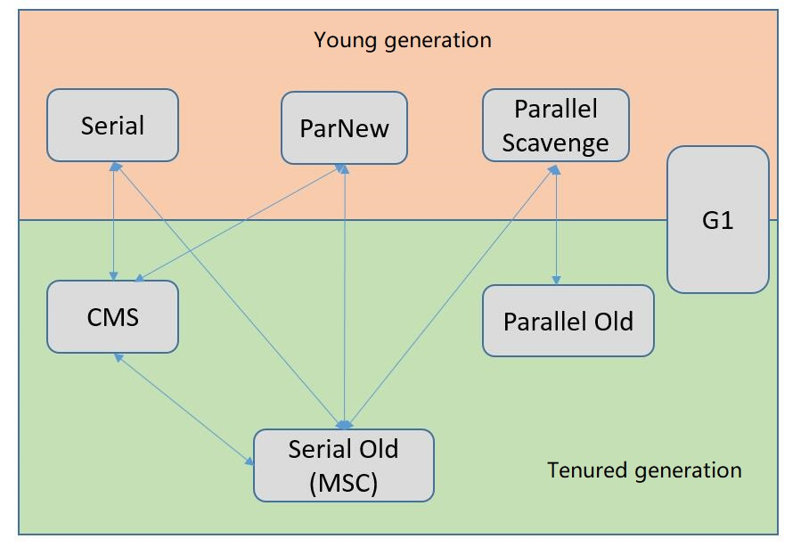
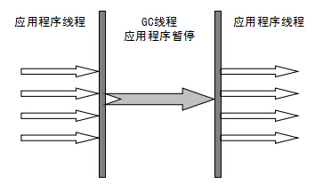
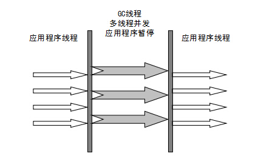
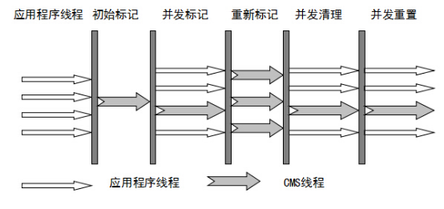
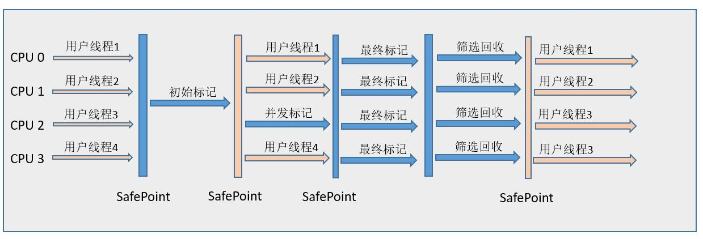

# 垃圾收集器

HotSpot 虚拟机提供了多种垃圾收集器，每种收集器都有各自的特点，虽然我们要对各个收集器进行比较，但并非为了挑选出一个最好的收集器。我们选择的只是对具体应用最合适的收集器。 

下图为收集器适用的范围，连线表示可以共同使用。



## 新生代垃圾收集器

### Serial 垃圾收集器

Serial 垃圾收集器是**单线程**的。只开启一条 GC 线程进行垃圾回收，并且在垃圾收集过程中停止一切用户线程(Stop The World)。 

是虚拟机运行在 Client 模式下的默认新生代收集器。简单而高效，对于限定单个 CPU 环境来说，Serial 收集器没有线程交互的开销，可以获得最高单线程收集效率。

一般客户端应用所需内存较小，不会创建太多对象，而且堆内存不大，因此垃圾收集器回收时间短，即使在这段时间停止一切用户线程，也不会感觉明显卡顿。只要不要频繁发生，这点停顿可以接受。因此 Serial 垃圾收集器**适合客户端**使用。 



### ParNew 垃圾收集器

ParNew 是 Serial 的**多线程**版本。由多条 GC 线程并行地进行垃圾清理。但清理过程依然需要 Stop The World。 

ParNew 追求“**低停顿时间**”,与 Serial 唯一区别就是使用了多线程进行垃圾收集，在多 CPU 环境下性能比 Serial 会有一定程度的提升；但**线程切换需要额外的开销**，因此在单 CPU 环境中表现不如 Serial。 

ParNew 是许多运行在 Server 模式下的虚拟机首选的新生代收集器。除了 Serial 收集器，只有他可以与 CMS 配合工作。



### Parallel Scavenge 垃圾收集器

Parallel Scavenge 收集器是多线程、新生代的收集器，它也是使用复制算法的收集器。它的特点在于：

- Parallel Scavenge： 追求 CPU 吞吐量，能够在较短时间内完成指定任务，因此适合没有交互的后台计算。 
- 其他收集器：尽可能地缩短垃圾收集时用户线程的停顿时间。

吞吐量 = 运行用户代码时间 / (运行用户代码时间 + 垃圾收集时间) 

追求高吞吐量，可以通过减少 GC 执行实际工作的时间，然而，仅仅偶尔运行 GC 意味着每当 GC 运行时将有许多工作要做，因为在此期间积累在堆中的对象数量很高。单个 GC 需要花更多的时间来完成，从而导致更高的暂停时间。而考虑到低暂停时间，最好频繁运行 GC 以便更快速完成，反过来又导致吞吐量下降。 

- 通过参数 -XX:GCTimeRadio 设置垃圾回收时间占总 CPU 时间的百分比，相当于吞吐量的倒数。
- 通过参数 -XX:MaxGCPauseMillis 设置垃圾处理过程最久停顿时间。
- 通过命令 -XX:+UseAdaptiveSizePolicy 开启自适应策略。我们只要设置好堆的大小和 MaxGCPauseMillis 或 GCTimeRadio，收集器会自动调整新生代的大小、Eden 和 Survivor 的比例、对象进入老年代的年龄，以最大程度上接近我们设置的 MaxGCPauseMillis 或 GCTimeRadio。

自适应调节策略是 Parallel Scavenge 收集器与 ParNew 收集器的重要区别之一。

## 老年代垃圾收集器

### Serial Old 垃圾收集器

Serial Old 收集器是 Serial 的老年代版本，都是**单线程收集器**，只启用一条 GC 线程，适用于 Client 模式。它们唯一的区别就是：

- Serial Old 工作在老年代，使用 “标记-整理” 算法
- Serial 工作在新生代，使用 “复制” 算法。 

### Parallel Old 垃圾收集器

Parallel Old 收集器是 Parallel Scavenge 的老年代版本，追求 CPU 吞吐量。 **使用多线程和 “标记-整理” 算法。**

### CMS 垃圾收集器

CMS（Concurrent Mark Sweep）收集器是一种以获得最短回收停顿时间为目标的收集器。常用于互联网站或 B/S 系统的服务端上，有良好的响应速度。

CMS 收集器是基于 “标记-清除” 算法实现的，整个过程分成4个步骤：

1. 初始标记：Stop The World，标记与 GC Roots 直接关联的对象。仅使用1条初始标记线程
2. 并发标记：进行 GC Roots Tracing 的过程。使用多条标记线程，与用户线程并发执行
3. 重新标记：Stop The World，修正并发标记期间因程序运行而产生的新废弃对象的标记。停顿时间会比初始标记稍长，但远比并发标记短。 使用多条标记线程并发执行 
4. 并发清除：只使用一条 GC 线程，与用户线程并发执行，清除刚才标记的对象。这个过程非常耗时。 

并发标记与并发清除过程耗时最长，但可以与用户线程一起工作。因此，**总体上说**，CMS 收集器的内存回收过程是与用户线程**一起并发执行**的。 



CMS 的缺点：

- 对 CPU 资源非常敏感，吞吐量低
- 无法处理浮动垃圾，可能出现 “Concurrent Mode Failure” 失败而导致 Full GC
- 使用 “标记-清除” 算法产生碎片空间，碎片过多时发生 Full GC

浮动垃圾：CMS 并发清理阶段用户线程也在运行，用户线程会产生新的垃圾，这一部分垃圾出现在标记过程之后，CMS 无法在当次集中处理，只好留到下一次 GC，这一部分垃圾称为浮动垃圾。

对于产生碎片空间的问题，可以通过开启 -XX:+UseCMSCompactAtFullCollection，在每次 Full GC 完成后都会进行一次内存压缩整理，将零散在各处的对象整理到一块。设置参数 -XX:CMSFullGCsBeforeCompaction告诉 CMS，经过了 N 次 Full GC 之后再进行一次内存整理。 

## G1 垃圾收集器

G1 是一款面向服务端应用的垃圾收集器，有以下特点：

- 并行与并发：使用多个 CPU 核心缩短 Stop The World 的停顿时间。部分收集器需要停顿的 GC 动作，G1 收集器通过并发的方式使程序继续执行
- 分代收集：分代概念仍然保留，不需要配合其他收集器就可以管理整个堆
- 空间整合：G1 整体是基于 “标记-整理” 算法实现的，局部（两个 Region 之间）是基于复制算法实现的。整个运行期间不会产生内存碎片，收集后可提供规整的内存空间。
- 可预测的停顿：G1 除了追求低停顿外，还建立可预测的停顿时间模型。

G1 将 Java 堆划分为多个大小相等的独立区域（Region），虽然保留着新生代与老年代的概念，但是新生代与老年代不再是物理隔离的了，它们都是一部分 Region（不需要连续）的集合。

G1 可以有计划地避免在整个 Java 堆中进行全区域的垃圾收集。G1 跟着各个 Region 里面的垃圾堆积的价值大小（回收所获得的空间大小以及回收所需时间的经验值），在后台维护一个优先列表，每次根据允许的收集时间，优先回收价值最大的 Region（Garbage-First）。

> 问题：一个对象和它内部所引用的对象可能不在同一个 Region 中，那么当垃圾回收时，是否需要扫描整个堆内存才能完整地进行一次可达性分析？ 

解决：每个 Region 都有一个 Remembered Set，**用于记录本区域中所有对象被外面对象引用的情况**，进行可达性分析时，只要在 GC Roots 中再加上 Remembered Set 即可防止对整个堆内存进行遍历。 

如果不计算维护 Remembered Set 的操作，G1 收集器的工作过程分为以下几个步骤： 

1. 初始标记：Stop The World，标记与 GC Roots 直接关联的对象，仅使用1条初始标记线程。且修改 TAMS 的值，让下一阶段用户程序并发时，能在正确可用的 Region 中创建对象。
2. 并发标记：进行 GC Roots Tracing 的过程。**使用1条标记线程**，与用户线程并发执行
3. 最终标记： Stop The World，修正变动的标记记录，虚拟机将对象变化记录在线程 Remembered Set Logs 里，这个阶段将 Remembered Set Logs 数据合到 Remembered Set 里。使用多条标记线程并发执行。 
4. 筛选回收：Stop The World ，先对各个 Region 的回收价值和成本进行排序，根据用户期望的 GC 停顿时间来制定回收计划



## GC 日志

```
	33.125: [GC [DefNew: 3324K->152K(3712K), 0.0025925 secs] 3324K->152K(11904K), 0.0031680 secs]
	100.667: [Full GC [Tenured: 0K->210K(10240K), 0.0149142 secs] 4603K->210K(19456K), [Perm: 2999K->2999K(21248K)], 0.0150007 secs] [Times: user=0.01 sys=0.00, real=0.02 secs]
```

最前面的数字 “33.125” 和 “100.667”：表示 GC 发生的时间，是虚拟机启动以来经历的时间。

“[GC” 和 “[Full GC” 表示垃圾收集的类型，如果是 Full GC 表示发生 Stop The World。

“[DefNew”、“[Tenured”、“[Perm” 表示 GC 发生的区域，区域名与使用的 GC 收集器相关。如 “[DefNew” 是 Serial 收集器的。

方括号内部的 “3324K->152K(3712K)” 含义是 "GC 前该内存区域已使用容量 -> GC 后该内存区域已使用容量（该内存区域总容量）"。

方括号外部的 “3324K->152K(11904K)” 含义是 “GC 前 Java 堆已使用容量 -> GC 后 Java 堆已使用容量（Java堆总容量）”。

“0.0025925 secs” 表示该内存区域 GC 所占用时间。

“[Times: user=0.01 sys=0.00, real=0.02 secs]” 分别表示用户态消耗的 CPU 时间、内核态消耗的 CPU 时间、操作从开始到结束经过的墙钟时间。墙钟时间包括了等待 IO 等时间。