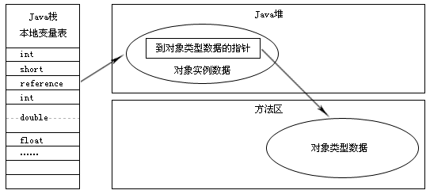

# 对象

## 对象的创建

在语言层面，创建对象（克隆、反序列化）通常使用一个 new 关键字，而在虚拟机中，对象创建有以下过程：

1. **检查类的加载**。遇到一条 new 指令，首先检查这个指令的参数是否能在常量池中定位到一个类的符号引用，并检查这个符号引用代表的类是否已被加载、解析、初始化过。如果没有则先执行类的加载过程。
2. **为新生对象分配内存**。对象所需的内存大小在类加载完成后可以确定，即这个阶段是把一块大小确定的内存从Java堆中划分出来。
   1. 如果 Java堆的内存绝对规整，即有用的内存放一边，空闲的内存放另一边，中间放着一个指针作为分界点的指示器，那么分配内存就是把那个指针向空闲空间挪动一段与对象大小相等的距离，这种方式成为 "指针碰撞"。
   2.  如果 Java堆的内存不是规整的， 即已使用内存与空闲内存相互交错，就无法使用指针碰撞。此时 JVM 维护一个列表，记录可用的内存块，在分配的时候从列表中找到一块足够大的空间划分给对象实例，并更新列表记录，这种分配称为 “空闲列表”。
3. 内存分配完后，虚拟机将分配到的内存空间都**初始化为零值（不包括对象头）**。如果使用了 TLAB，这个工作可提前到 TLAB分配时进行。这个操作保证了对象实例字段在 Java代码中可以不赋初值就直接使用。
4. 虚拟机要对对象进行必要的设置，如这个对象是哪个类的实例、如何找到类的元数据信息、对象哈希码、对象GC分代年龄等。**这些信息存放在对象头。**

5. 在虚拟机视角，对象已经产生了。在 Java程序的视角，**对象还需执行  &lt;init&gt; 方法。**（可以理解为构造方法）

在内存分配阶段，使用哪种分配方法取决于 Java堆是否规整，而 Java堆是否规整取决于垃圾收集器是否有压缩功能。因此，使用 Serial、ParNew 等带 Compact 过程的收集器，采用指针碰撞；而使用 CMS 等基于 Mask-Sweep 算法的收集器，采用空闲列表。

对象创建在并发情况下并不一定是线程安全的。如正在给对象A 分配内存，指针没来得及修改，对象B 同时使用了原来的指针分配内存。解决这种问题有以下方案：

1. 对分配内存空间的动作进行同步处理。实际上虚拟机采用 CAS 配上失败重试的方式保证更新操作的原子性。
2. 把内存分配动作按照线程划分在不同空间上进行，即每个线程在 Java堆预先分配一块内存，称本地线程分配缓冲（TLAB）。只有 TLAB 用完并分配新的 TLAB 时，才需要同步锁定。

## 对象的内存布局

对象在内存布局可以分成3块区域：对象头（Header）、实例数据（Instance Data）、对齐填充（Padding）。

1. 对象头包括两部分信息：
   1. 第一部分是**用于存储对象自身的运行时数据**，如 HashCode、GC分代年龄、锁状态标志位、线程持有的锁、偏向线程ID、偏向时间戳等。这一部分数据长度在 32/64位的虚拟机（未开启压缩指针）中分别是 32/64 bit，官方称为 “Mark Word”。
   2. 另一部分是**类型指针**，即对象指向它的类元数据的指针，虚拟机通过这个指针确定这个对象是哪个类的实例。但是并不是所有虚拟机实现都必须在对象数据上保留类型指针，即查找对象的元数据并不一定要经过对象本身。另外，如果对象是 Java数组，对象头还有一块用于记录数组长度的数据，因为虚拟机可以通过普通 Java对象的元数据确定 Java对象的大小，但是从数组的元数据中无法确定数组的大小。
2. 实例数据部分是对象真正存储的有效信息，也是在代码中定义的各种类型的字段内容。从父类继承下来的与子类中定义的都需要记录下来。这部分的存储顺序会收到虚拟机分配策略参数（FieldAllocationStyle）和字段在 Java代码中定义顺序的影响。HotSpot 虚拟机默认分配策略为：long/double、int/float、short/char、byte/boolean、oop（Ordinary Object Pointers），相同宽度的字段总是分配到一起。在这个前提下，父类定义的变量会出现在子类之前。如果 CompactFields 参数为 true（默认true），子类较窄变量也会插到父类变量空隙之中。
3. 对齐填充不是必然存在的，只起到了占位符的作用。HotSpot VM 的自动内存管理要求对象起始地址是8字节的整数倍，即对象大小必须是8字节的整数倍，因此需要对齐填充来补全。

对象头信息是与对象自身定义的数据无关的额外存储，考虑到虚拟机的空间效率，Mark Word 被设计成一个非固定的数据结构以便在极小的空间内存储尽量多的信息，它会根据对象的状态复用自己的存储空间。如在32位的 HotSpot 虚拟机中，如果对象处于未锁定的状态，那么 Mark Word 中的32bit 空间，25bit 存储对象 HashCode、4bit 存储对象分代年龄、2bit 存储锁标志位，1bit 固定为0。其他状态存储内容如下表：

| 存储内容                             | 标志位 | 状态               |
| :----------------------------------- | :----: | ------------------ |
| 对象HashCode、分代年龄               |   01   | 未锁定             |
| 指向锁记录的指针                     |   00   | 轻量级锁定         |
| 指向重量级锁的指针                   |   10   | 膨胀（重量级锁定） |
| 空，不需要记录信息                   |   11   | GC标记             |
| 偏向线程ID、偏向时间戳、对象分代年龄 |   01   | 可偏向             |

## 对象的访问定位

Java程序需要通过栈上的 reference 数据来操作堆上的具体对象，对象的访问方式主要有使用句柄和直接指针。

1. 使用句柄：Java 堆中会划分出一块内存作为句柄池，reference 中存储的就是对象的句柄地址，而句柄中包含了对象实例数据与类型数据各自的具体地址信息。

   

2. 直接指针：reference 存储的直接是对象地址

   

对比：

1. 使用句柄的最大好处就是 reference 中存储的是稳定的句柄地址，在对象被移动（垃圾回收时移动）时只会改变句柄中的实例数据指针，而 reference 本身不需要修改。
2. 使用直接指针的最大好处就是速度更快，它节省了一次指针定位的时间开销。Sun HotSpot 虚拟机采用的是这一种。