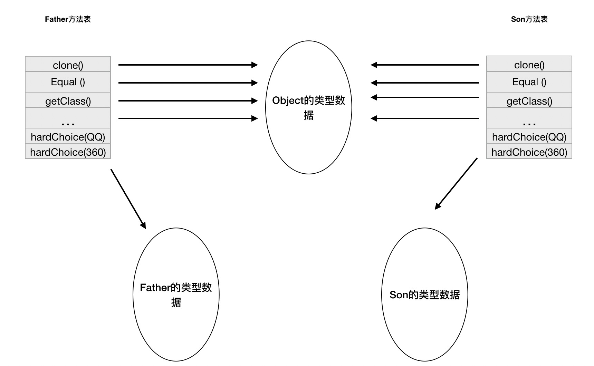

# 方法调用

方法调用不等同于方法执行，方法调用阶段唯一的任务是确定被调用方法的版本（即调用哪一个方法），不涉及方法内部的具体运行过程。

方法调用在 Class 文件中存储的都是符号引用，而不是内存的入口地址。因此需要在类加载期间，甚至运行期间才能确定目标方法的直接引用。

## 解析

所有方法调用的目标方法在 Class 文件中是一个常量池的符号引用，在类加载的解析过程中，会将一部分符号引用转化为直接引用。

这种解析成立的前提：方法在程序真正运行之前就有一个确定的版本调用，并且这个方法的调用版本在运行期是不可改变的，即调用目标在编译时就确定下来。这类方法的调用称为解析。

Java 虚拟机提供了5条方法调用字节码指令：

- invokestatic：调用静态方法
- invokespecial：调用实例构造器 &lt;init&gt; 方法、私有方法、父类方法
- invokevirtual：调用所有虚方法
- invokeinterface：调用接口方法，会在运行时再确定实现该接口的对象
- invokedynamic：现在运行时动态解析出调用点限定符所引用的方法，然后再执行该方法。这个指令的分派逻辑是由用户所设定的引导方法决定的；而其他4条是固化在 Java 虚拟机内部的。

只要能被 invokestatic 与 invokespecial 指令调用的方法，都可以在解析阶段确定唯一的调用版本，符合这个条件的有静态方法、私有方法、实例构造器、父类方法。他们在类加载的时候会把符合引用解析为该方法的直接引用，这些方法称为非虚方法。

Java 的非虚方法还包括 final 修饰的方法。虽然 final 修饰的方法是使用 invokevirtual 指令调用的，但它无法被覆盖，没有其他版本，多态选择的结果也是唯一的。

## 分派

解析调用是个静态的过程，在编译期间就完全确定，在类加载的解析阶段就会把涉及到的符号引用全部转变成可确定的直接引用。而分派（Dispatch）调用可能是静态的也可能是动态的，根据分派依据的宗量数可以分为单分派与多分派。两两组合构成4种分派情况：静态单分派、静态多分派、动态单分派、动态多分派。

分派的调用过程会揭示动态性特征的一些最基本的体现，如重载与重写在 Java 虚拟机中的实现。

### 静态分派

方法静态分派代码：

```java
public class StaticDispatch {
	static abstract class Human {}
    static class Man extends Human {}
    static class Woman extends Human {}
    
    public void sayHello(Human guy) {
        System.out.println("Hello guy");
    }
    
    public void sayHello(Man guy) {
        System.out.println("Hello Man");
    }
    
    public void sayHello(Woman guy) {
        System.out.println("Hello Woman");
    }
    
    public static void main(String[] args) {
        Human man = new Man();
        Human woman = new Woman();
        StaticDispatch sr = new StaticDispatch();
        sr.sayHello(man);
        sr.sayHello(woman);
    }
}

运行结果===========================================
    Hello guy
    Hello guy
```

对于代码 `Human man = new Man();` ，有以下概念：

- 静态类型（Static Type）：如代码中的 `Human` ，也可称为外观类型（Apparent Type）
- 实际类型（Actual Type）：如代码中的 `Man`

静态类型和实际类型在程序中都可以发生变化，区别在于静态类型的变化仅在使用时发生，变量本身的静态类型不会发生改变，并且最终的静态类型是在编译期可知的；而实际类型变化的结果在运行期才可确定，编译器在编译程序时不知一个对象的实际类型。

```java
// 实际类型的变化
Human man = new Man();
man = new Woman();
// 静态类型的变化
sr.sayHello((Man)man);
sr.sayHello((Woman)man);
```

虚拟机在重载时是通过参数的静态类型而不是实际类型作为判断依据的。静态类型是编译期可知的，因此在编译阶段 Java 编译器会根据参数静态类型决定使用哪个重载版本。

**所有依赖静态类型来定位方法执行版本的的分派动作称为静态分派**。静态分派的典型应用就是方法重载。静态分派发生在编译阶段，因此确定静态分派的动作实际上不是由虚拟机来执行的。

### 动态分派

动态分派的体现：重写。代码如下：

```java
public class DynamicDispatch {
	static abstract class Human {
        protected abstract void sayHello();
    }
    
    static class Man extends Human {
        @Override
        protected void sayHello() {
            System.out.println("man say Hello");
        }
    }
    
    static class Woman extends Human {
        @Override
        protected void sayHello() {
            System.out.println("woman say Hello");
        }
    }
    
    public static void main(String[] args) {
        Human man = new Man();
        Human woman = new Woman();
        man.sayHello();
        woman.sayHello();
        man = new Woman();
        man.sayHello();
    }
}

运行结果============================================
    man say Hello
    woman say Hello
    woman say Hello
```

静态类型同是 `Human` 的两个变量，调用 `sayHello` 方法得到不同的结果。因为这两个变量的实际类型不同，Java 虚拟机根据实际类型来分派方法执行版本。用 javap 命令输出字节码，可以看到使用 invokevirtual 进行方法调用。

以字节码为例（三次调用的字节码指令一致）：

```
invokevirtual #22		// Method com/ljs/DynamicDispatch$sayHello:()V
```

对象是执行方法的所有者，称为接收者（Receiver）。在字节码文件中，两次调用 sayHello 的字节码指令是完全一致的，但是最终执行的目标方法并不相同，这与 invokevirtual 指令的运行时解析有关，解析过程如下：

1. 找到操作数栈栈顶的第一个元素所指向的对象的实际类型，记作 C
2. 如果在类型 C 中找到与常量中的描述符和简单名称都相符的方法，则进行访问权限校验，如果通过则返回这个方法的直接引用，查找过程结束；如果不通过，则返回 java.lang.IllegalAccessError 异常
3. 否则，按照继承关系从下往上依次对 C 的各个父类进行第二步的搜索和验证过程
4. 如果始终没有找到合适的方法，则抛出 java.lang.AbstractMethodError 异常

**我们将在运行期根据实际类型确定方法执行版本的分派过程称为动态分派。**Java 语言重写的本质就是 invokevirtual 指令把常量池中的类方法引用解析到了不同的直接引用上。

### 单分派与多分派

方法的接收者与方法的参数统称为方法的宗量。根据分派基于多少种宗量，可以分成单分派与多分派。单分派是根据一个宗量对目标方法进行选择，多分派是根据多于一个宗量对目标方法进行选择。以下代码为例：

```java
public class Dispatch {
    static class AA {}
    static class BB {}
    
    public static class Father {
        public void choose(AA arg){
            System.out.println("father choose AA");
        }
        public void choose(BB arg){
            System.out.println("father choose BB");
        }
    }
    
    public static class Son extends Father {
        public void choose(AA arg){
            System.out.println("son choose AA");
        }
        public void choose(BB arg){
            System.out.println("son choose BB");
        }
    }
    
    public static void main(String[] args) {
        Father father = new Father();
        Father son = new Son();
        father.choose(new BB());
        son.choose(new AA());
    }
}

运行结果============================================
	father choose BB
    son choose AA
```

编译阶段编译器的选择过程，也就是静态分派的过程。此时选择目标方法的依据有两点：一是静态类型是 Father 还是 Son，二是方法参数是 AA 还是 BB。选择的最终产物是两条 invokevirtual 指令，指令的参数分别为常量池中指向 Father.choose(AA) 与 Father.choose(BB) 方法的符号引用。因为是根据两个宗量进行选择，所以 **Java 语言的静态分派属于多分派类型**。

运行阶段虚拟机的选择过程，也就是动态分派的过程。执行 invokevirtual 指令时，虚拟机不会关心传递过来的参数，只会考虑方法接收者的实际类型。因为只有一个宗量作为选择依据，**所以 Java 语言的动态分派属于单分派类型**。

### 虚拟机动态分派的实现

由于动态分派是非常频繁的动作，且动态分派的方法版本选择过程需要运行时在类的方法元数据中搜索合适的目标方法。基于性能的考虑，稳定优化的方法就是为类在方法区中建立一个虚方法表（vtable），使用虚方法表索引来代替元数据查找以提高性能。与此类似，invokeinterface 执行时，有接口方法表（itable）。虚方法结构如下图



虚方法表存放着各个方法的实际入口地址。如果方法在子类没有被重写，那子类与父类的虚方法表里面的入口地址是一致的，都指向父类的实现入口。如果子类重写了这个方法，子类方法表中的地址将会替换为指向子类实现版本的入口地址。

具有相同签名的方法，在父类、子类的虚方法表中应具有一样的索引号。这样当类型变换时，仅需要变更查找的方法表，就可以从不同的方法表中按索引转换出所需的入口地址。

方法表一般在类加载的连接阶段进行初始化，准备了类的变量初始值后，虚拟机就会把类的方法表也初始化。

虚拟机除了使用方法表外，还使用内联缓存、基于"类型继承关系分析"技术的守护内联两种非稳定的优化方法来提高性能。