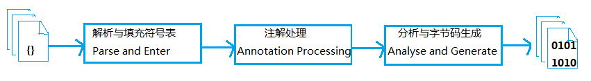

# 早期（编译期）优化

Java 编译有3种：

- 前端编译器将 .java 文件转变成 .class 文件
- 即时编译器（JIT）将字节码转变成机器码
- 静态提前编译器（AOT）直接将 .java 文件编译成本地机器代码

## javac 编译器

从 sun javac 的代码中看，编译过程大概分成3个过程：

- 解析与填充符号表过程
- 插入式注解处理器的注解处理过程
- 分析与字节码生成过程

3个步骤之间的交互关系如下图

### 解析与填充符号表

解析步骤包括词法分析与语法分析两个过程。

- 词法分析将源代码的字符流转变成标记（Token）集合，标记包含关键字、变量名、字面量、运算符等。javac 的源码中，词法分析由 com.sun.tools.javac.parser.Scanner 类实现。

- 语法分析根据 Token 序列构造抽象语法树，抽象语法树是描述程序代码语法结构的树形表示方式，每一个节点都代表着程序代码中的一个语法结构。词法分析由 com.sun.tools.javac.parser.Parser 类实现。 

之后的动作是填充符号表。符号表是由一组符号地址和符号信息构成的表格。在语义分析中，符号表内容用于检查语义和产生中间代码；在目标代码生成阶段，当对符号名进行地址分配时，符号表是地址分配的依据。

javac 的源码中，填充符号表由 com.sun.tools.javac.comp.Enter 类实现，此过程的出口是一个待处理列表（To Do List），包含了每一个编译单元的抽象语法树的顶级节点，以及 package-info.java 的顶级节点。

### 注解处理器

在 JDK 1.6 中实现了 JSR-269 规范，注解在运行期间发挥作用，提供了一组插入式注解处理器的标准 API 在编译期间对注解进行处理，可以把它看做是一组编译器的插件，在这些插件里面，可以读取、修改、添加抽象语法树中的任意元素。

如果这些插件在处理注解期间对语法树进行了修改，编译器将回到解析及填充符号表的过程重新处理，直到所有插入式注解处理器都没有再对语法树进行修改为止，每一次循环称为一个 Round。

javac 源码中插入式注解处理器的初始化过程是在 `JavaCompiler.initProcessAnnotations()` 方法中完成的，而它的执行过程在 `JavaCompiler.processAnnotation()` 方法中完成。

### 语义分析与字节码生成

语义分析的主要任务是对结构上正确的源程序进行上下文有关性质的审查，如进行类型审查。（是否合乎语义逻辑必须限定在具体的语言与具体的上下文环境之中才有意义）

#### 标注检查

由 `JavaCompiler.attribute()` 方法进行。标注检查步骤检查的内容包括诸如变量使用前是否已经被声明、变量与赋值之间的数据类型是否够匹配以及常量折叠。

javac 中实现类是 com.sun.tools.javac.comp.Attr 类和 com.sun.tools.javac.comp.Check 类

#### 数据及控制流分析

`JavaCompiler.flow()` 方法进行。数据及控制流分析是对程序上下文逻辑更进一步的验证，它可以检查出诸如程序局部变量在使用前是否有赋值、方法的每条路径是否有返回值、是否所有的受查异常都被正确处理了等问题。

编译时期与类加载时期的数据及控制流分析的目的基本是相同的，但是校验范围有所不同，某些校验项只在编译期或运行期才能进行。以局部变量为例：

- 局部变量在常量池中没有 CONSTANT_Fieldref_info 的符号引用，自然没有访问标志的信息，甚至可能连名称都不会保存下来。在 class 文件中，不能知道一个局部变量是不是声明为 final。

- 将局部变量声明为 final，对运行期没有影响，变量的不变性仅仅由编译器在编译期间保障。

#### 解语法糖

也称糖衣语法，指在计算机中添加某种语法，这种语法对语言的功能没有影响，但是更方便程序员使用，通常来说，使用语法唐能够增加程序的可读性，从而减少程序代码出错的机会。 

Java 中最常用的语法糖有泛型、变长参数、自动装箱/拆箱等，虚拟机运行时不支持这些语法，它们在编译时还原为简单的基础语法结构。

在 javac 源码中，解语法糖过程由 desugar() 方法触发，在 com.sun.tools.javac.comp.TransTypes 类和 com.sun.tools.javac.comp.Lower 类中完成。

#### 字节码生成

字节码生成是 javac 编译的最后一个阶段，由 com.sun.tools.javac.jvm.Gen 类完成。

保证一定是按先执行父类的实例构造器，然后初始化变量，最后执行语句块的顺序进行。 

### 语法糖

#### 泛型与类型擦除

泛型本质是参数化类型（Parametersized Type）的应用，也就是说所操作的数据类型被指定为一个参数。这种参数类型可以用在类、 接口和方法的创建中，分别称为泛型类、 泛型接口和泛型方法。 

**Java 语言中的泛型只在程序源码中存在，在编译后的字节码文件中，已经替换为原来的原生类型（Raw Type，也称为裸类型），并且在相应的地方插入了强制转型代码**，对于运行期的 Java 语言来说，`ArrayList<int>` 与 `ArrayList<String>` 是同一个类，所以泛型技术实际上是 Java 语言的一颗语法糖，Java 语言中的泛型实现方法称为类型擦除，基于这种方法实现的泛型称为伪泛型。

Signature 是解决伴随泛型而来的参数类型的识别问题中最重要的一项属性，它的作用就是存储一个方法在字节码层面的特征签名，这个属性中保存的参数类型并不是原生类型，而是包括了参数化类型的信息。 

擦除法所谓的擦除，仅仅是对方法的 Code 属性中的字节码进行擦除，实际上元数据中还是保留了泛型信息，这也是我们能通过反射手段取得参数化类型的根本依据。 

#### 拆箱、装箱与 foreach

自动装箱、拆箱在编译之后会被转化成对应的包装和还原方法，如 `Integer.valueOf()` 与 `Integer.intValue()`。 

foreach 循环则把代码还原成了迭代器的实现，这也是为何遍历循环需要被遍历的类实现 Iterable 接口的原因。 

变长参数会变成数组类型的参数。

但是，包装类的 " **==** " 运算在不遇到算术运算的情况下不会自动拆箱，以及它们的 `equals()` 方法不处理数据转型的关系。 

#### 条件编译

C、 C++ 中使用预处理器指示符（#ifdef）来完成条件编译。 C、 C++ 的预处理器最初的任务是解决编译时的代码依赖关系（如非常常用的 #include 预处理命令）。 

在 Java 语言中并没有使用预处理器，因为 Java 语言天然的编译方式（编译器并非一个个的编译 Java 文件，而是将所有编译单元的语法树顶级节点输入到待处理列表后再进行编译，因此各个文件之间能够互相提供符号信息）无须使用预处理器。

- 条件编译的实现方式使用了 **if** 语句，所以它必须遵循最基本的 Java 语法，只能写在方法体内部，因此它只能实现语句基本块（Block）级别的条件编译，而没有办法实现根据条件调整整个 Java 类的结构。

- Java 中根据布尔常量值的真假，编译器会把分支中不成立的代码块擦除掉，这一工作将在编译器解析语法糖阶段完成。

在 com.sun.tools.javac.comp.Lower 类中完成。由于这种条件编译的实现方式使用了 if 语句，所以必须遵守 java 的语法，只能写在方法内部，只能实现语句基本块级别的条件编译。