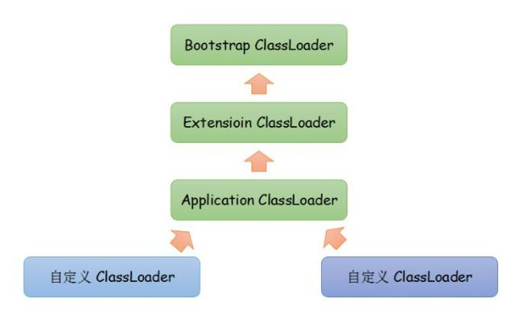

# 类加载器

## 类与类加载器

对于任意一个类，都需要由加载它的类加载器和这个类本身一同确立其在 Java 虚拟机的唯一性。每一个类加载器，都拥有一个独立的类名称空间。

比较两个类是否“相等”，只有在这两个类是由同一个类加载器加载的前提下才有意义，否则，即使这两个类来源于同一个 Class 文件，被同一个虚拟机加载，只要加载它们的类加载器不同，那么这两个类就必定不相等。 

这里的“相等”，包括代表类的 Class 对象的 equals() 方法、isInstance() 方法的返回结果，也包括使用 instanceof 关键字做对象所属关系判定等情况。 

## 双亲委派机制

### 类加载器种类

从 Java 虚拟机角度来讲，存在两种类加载器：

- 启动类加载器（Bootstrap ClassLoader）：用 C++ 实现，是虚拟机的一部分
- 所有其他的类加载器，用 Java 语言实现，独立于虚拟机外部，并且继承于 java.lang.ClassLoader

从 Java 开发角度，系统提供3种类加载器：

- 启动类加载器（Bootstrap ClassLoader）：负责将存放在 `\lib` 目录中的，或被 `-Xbootclasspath` 指定的路径，并且能被虚拟机识别的（仅按照文件名识别，如 rt.jar，名字不符合的类库即使放在 lib 目录中也不会被加载）类库加载到虚拟机内存中。 启动类加载器无法被 Java 程序直接引用，如果把加载请求委派给启动类加载器，直接使用 null 替换即可。

- 扩展类加载器（Extension ClassLoader）：负责加载 `\lib\ext` 目录中的所有类库，或被 `java.ext.dirs` 系统变量指定的路径的所有类库，开发者可以直接使用扩展类加载器。 

- 应用程序类加载器（Application ClassLoader）：由于这个类加载器是 ClassLoader 中的 getSystemClassLoader() 方法的返回值，所以一般也称它为“系统类加载器”。它负责加载用户类路径（classpath）上所指定的类库，开发者可以直接使用这个类加载器，如果应用程序中没有自定义过自己的类加载器，一般情况下这个就是程序中默认的类加载器。 

如果有必要，还可以加入自己定义的类加载器。 类加载器的关系如图所示：

### 双亲委派模型

双亲委派模型是描述类加载器之间的层次关系。它要求除了顶层的启动类加载器外，其余的类加载器都应当有自己的父类加载器。父子关系一般不会以继承的关系实现，而是以组合关系来复用父加载器的代码。

### 工作过程

如果一个类加载器受到了类加载请求，它首先不会自己去尝试加载这个类，而是把这个请求委派给父类加载器去完成，每一个层次的类加载器都是如此，因此所有的加载请求最终都应该传送到顶层的启动类加载器中。只有当父类加载器反馈自己无法完成这个加载请求时（它的搜索范围没有找到所需的类），子加载器才会尝试自己去加载。

### 双亲委派模型优点

使用双亲委派模型来组织类加载器之间的关系，那么 Java 类随着它的类加载器一起具备了一种带有优先级的层次关系。

像 java.lang.Object 这些存放在 rt.jar 中的类，无论使用哪个类加载器加载，最终都会委派给最顶端的启动类加载器加载，从而使得不同加载器加载的 Object 类都是同一个。 

相反，如果没有使用双亲委派模型，由各个类加载器自行去加载的话，如果用户自己编写了一个称为 java.lang.Object 的类，并放在 classpath 下，那么系统将会出现多个不同的 Object 类，Java 类型体系中最基础的行为也就无法保证。 
