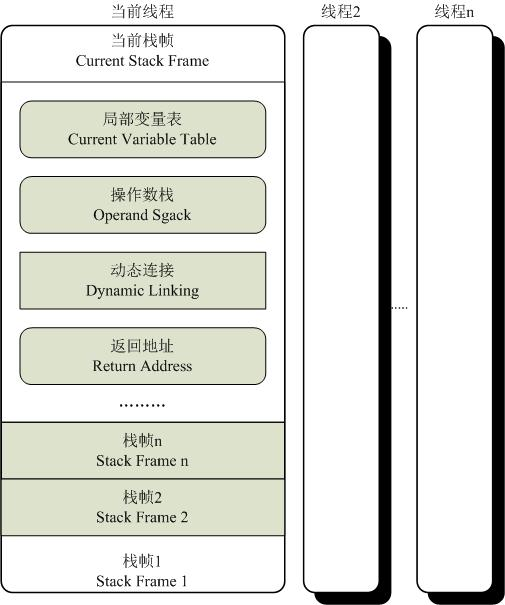
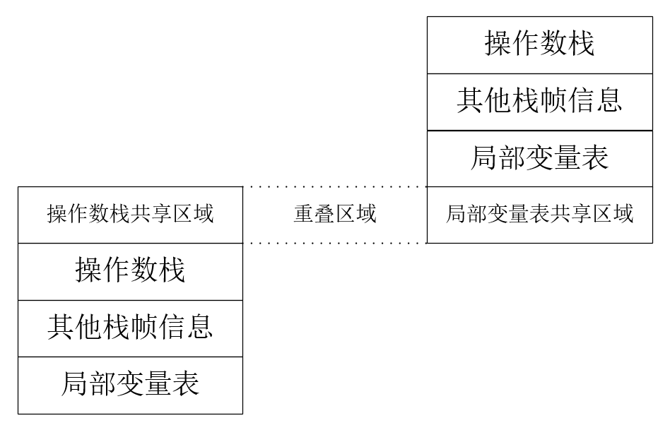

# 运行时栈帧结构

栈帧是虚拟机进行方法调用和方法执行的数据结构，是虚拟机运行时数据区中的虚拟机栈的栈元素。

每一个栈帧都包括了局部变量表、操作数栈、动态连接、方法返回地址和额外信息。在编译代码的时候，局部变量表与操作数栈的大小已经确定，并写道方法表的 Code 属性中。因此栈帧分配多少内存，不受到程序运行时变量数据的影响，只取决于虚拟机的实现。栈帧结构图如下：

## 局部变量表

局部变量表是一组变量值存储空间，用于存放方法参数与方法内部定义的局部变量。编译时，在方法的 Code 属性的 max_locals 数据项确定了该方法的局部变量表的最大容量。

局部变量表以变量槽（Variable Slot, 称 Slot）为最小单位。虚拟机规范没有指定 Slot 占用的内存大小，但是要保证如果使用 64bit 的物理空间实现一个 Slot，虚拟机要使用对齐和补白的手段使 Slot 在外观上与 32bit 虚拟机相同。

每个 Slot 能存放一个 boolean、byte、char、short、int、float、reference、returnAddress 类型的数据。对于 64bit 数据，虚拟机以高位对齐的方式为其分配两个连续的 Slot 空间。64bit 的 long/double 的非原子性协定：把一次 long/double 数据类型读写分割为两次 32bit 读写。

在方法执行时，虚拟机使用局部变量表完成参数值到参数变量列表的传递过程，如果执行的是实例方法（非static方法），那局部变量表第0位索引的 Slot 默认用于传递方法所属对象的实例（this）。

局部变量表的 Slot 是可重用的，方法体的变量，其作用域并不一定覆盖整个方法体。在某些情况下，Slot 的复用会直接影响到系统的垃圾收集行为。

## 操作数栈

操作数栈也称操作栈，它的最大深度在编译时写入方法 Code 属性的 max_stacks 数据项中。方法执行的任何时候，操作数栈的深度都不会超过 max_stacks 设定的值。

一个方法开始时，操作数栈是空的。在方法执行过程中，会有各种字节码指令往操作数栈中写入和提取内容，也就是入栈\出栈操作。

两个栈帧是完全相互独立的，但是在大多数虚拟机实现中都会出现一些优化，令两个栈帧出现一部分重叠。如下图局部变量表与操作数栈部分重叠，这样在进行方法调用时就可以共用一部分数据，无须额外进行参数复制传递。

## 动态连接

每个栈帧都包含一个指向运行时常量池中该栈帧所属方法的引用，持有这个引用是为了支持方法调用过程中的动态连接。

字节码中的方法调用指令可以以常量池中指向方法的符号引用作为参数，这些符号引用一部分会在类加载阶段或第一次使用的时候就转化为直接引用，这种转化成为静态解析。另一部分将在每一次运行期间转化为直接引用，这部分称为动态连接。

## 方法返回地址

