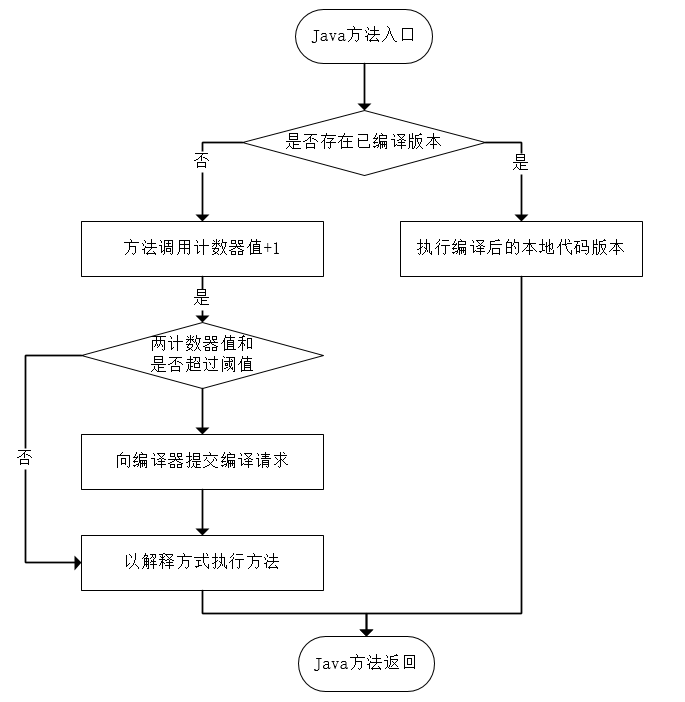

# 晚期（编译期）优化

Java 程序最初是通过解释器进行解释执行的，但是虚拟机发现部分方法或代码块运行特别频繁，就会把这些代码认定为热点代码。为了提高热点代码的执行效率，在运行时，虚拟机会把这些代码编译成与本地平台相关的机器码，并进行各种层次的优化，完成这个任务的编译器叫做即时编译期（Just In Time，JIT）。

JIT 编译期不是虚拟机必需的部分，Java 虚拟机规范并没规定必须要有即时编译器的存在。

## 解释器与编译器

解释器与编译器经常配合工作，解释器与编译器的优劣势：

- 程序迅速启动与执行时，解释器可以首先发挥作用，省去编译时间，立即执行。
- 随着时间推移，编译器将越来越多的代码编译成本地代码，获取更高的执行效率。
- 当内存资源限制较大时，可以使用解释执行节约内存，反之用编译执行提升效率。
- 解释器可以作为编译器的 “逃生门”，当编译器激进优化不成立时，如加载了新类后类型继承结构出现变化、出现 “罕见陷阱” 是可以通过逆优化退回到解释状态继续执行。

HotSpot 虚拟机内置两个 JIT 编译器，分别为 Client Compiler 与 Server Compiler，简称 C1、C2 编译器。

用户可以强制虚拟机运行模式：

- Mixed Mode：混合模式
- Interpreted Mode：解释模式，完全不使用编译器。使用参数 “-Xint” 指定
- Compiled Mode：编译模式，优先编译执行，但解释器仍然在编译无法进行的情况下介入执行。使用参数 “-Xcomp” 指定

HotSpot 虚拟机有分层编译的策略，在 JDK1.7 的 Server 模式下作为默认编译策略被开启。分层编译根据编译器编译、优化的规模和耗时，划分以下编译层次：

1. 第0层，程序解释执行，解释器不开启性能监控功能（Profiling），可触发第1层编译
2. 第1层，称为 C1编译，将字节码编译为本地代码，进行简单、可靠的优化，如有必要将加入性能监控的逻辑
3. 第2层，称为 C2编译，也是将字节码编译为本地代码，但是会启动一些编译耗时较长的优化，甚至会根据性能监控信息进行一些不可靠的激进优化

## 编译对象与触发条件

被 JIT 编译器认为热点代码的有两类：

- 被多次调用的方法
- 被多次执行的循环体

对于第一种情况，编译器会将整个方法作为编译对象，这种编译也是标准的 JIT 编译方式。

对于第二种情况，编译器仍然会将整个方法作为编译对象，但是这种编译方式发生在方法执行过程中，可形象地称为栈上替换（On Stack Replacement，OSR），即方法栈帧还在栈上，方法就被替换了。

判断一段代码是不是热点代码，是不是需要触发即时编译，这样的行为称为热点探测。目前主要的热点探测判定方式有两种：

1. 基于采样的热点探测：虚拟机会周期性地检查各个线程的栈顶，如果发现某些方法经常出现在栈顶，那这个方法就是热点方法。这种方法的好处在于实现简单、高效，容易获得方法调用关系（将调用堆栈展开即可），缺点是很难精确地确认一个方法的热度，容易因为受到线程阻塞或别的外界因素的影响而扰乱热点探测。
2. 基于计数器的热点探测：虚拟机会为每个方法（或代码块）建立计数器，统计方法执行次数，当方法执行次数超过一定的阈值，则认为它是热点方法。这种方法实现比较麻烦，需要为每个方法建立并维护计数器，且不能直接获取到方法的调用关系，但它的统计结果更加精确和严谨。

HotSpot 虚拟机采用的是基于计数器的热点探测方法，且它为每个方法准备两类计数器：方法调用计数器和回边计数器。

### 方法调用计数器

方法调用计数器可以使用 `-XX: CompileThreshold` 进行设定。Clinet 模式下默认是1500，Server 模式下默认是1000。运行流程图如下：

如果不做任何设置，执行引擎不会同步等待即时编译请求完成，而是继续进入解释器按照解释方式执行字节码，直到提交的请求被即时编译器编译完成。编译完成后，方法的入口地址会被系统自动改写成新的，下次调用就会使用编译后的版本。

如果不做任何设置，方法调用计数器统计的不是方法调用的绝对次数，而是相对的执行频率，即一段时间内方法被调用的次数。

如果一段时间内方法调用的次数仍不足让 JIT 编译器编译，那么这个方法的调用计数器的值会减少一半，这个过程称为方法调用计数器热度的衰减（Counter Decay），而这段时间叫做半衰周期。

进行热度衰减的动作是虚拟机进行 GC 的时候顺便进行的，可以使用参数 `-XX: -UserCounterDecay` 关闭热度衰减，让方法计数器统计方法调用的绝对次数。可以使用 `-XX: CounterHalfLifeTime` 设置半衰周期，单位为秒。

### 回边计数器

可以使用参数 `-XX: BackEdgeThreshold` 设置回边计数器阈值，但实际上并不使用这个参数，而是使用 `-XX: OnStackReplacePercentage` 来间接调整阈值。公式如下：

- Client 模式：
    $$
    方法调用计数器阈值(CompileThreshold) \times OSR比率(OnStackReplacePercentage) / 100
    $$
    
    OnStackReplacePercentage 默认为933，都取默认值，则回边计数器默认为13995
    
- Server 模式：
    $$
    方法调用计数器阈值 \times （OSR比率 - 解释器监控比率(InterpreterProfilePercentage)) / 100
    $$
    
    OSR比率默认为140，InterpreterProfilePercentage默认为33，都取默认值，则回边计数器阈值为10700。

当超过阈值时，会提交 OSR 编译请求，并将回边计数器的值降低一些，以便继续在解释器执行循环，等待编译器输出编译结果。执行过程如下图：

回边计数器没有计数热度衰减，因此计数器统计的是方法循环执行的绝对次数。当计数器溢出时，会将方法调用计数器的值调整的溢出状态，这样下次进入方法就会执行标准编译过程。

## 编译优化技术

编译优化技术有公共子表达式消除、数组边界检查消除、方法内联、逃逸分析等。

### 公共子表达式消除

如有代码：`int d = b*c*12 + a + (a + b*c)`，可以有以下优化：

1. 使 `E = b*c`，表达式变为：`int d = E*12 + a + (a + E)`
2. 代数化简，表达式变为：`int d = E*13 + 2*a`

### 数组边界检查消除

比如在循环遍历数组时，编译器只需通过数据流分析判定循环变量的取值范围在 [0, arrya.length) 之间，那么循环过程中就可以把数组的上下界检查消除。

与之类似的有隐式异常处理、自动装箱消除、安全点消除、消除反射等。

### 方法内联

只有使用 invokespecial 指令调用的私有方法、实例构造器、父类方法以及使用 invokestatic 指令进行调用的静态方法才是在编译器进行解析的，其他 Java 方法都需要在运行时进行方法接收者的多态选择。Java 语言默认的实例方法是虚方法。

方法内联能去除方法调用的成本，同时也为其他优化建立了良好的基础，因此各种编译器一般会把内联优化放在优化序列的最靠前位置，然而由于 Java 对象的方法默认都是虚方法，因此方法调用都需要在运行时进行多态选择，为了解决虚方法的内联问题，首先引入了 " 类型继承关系分析（CHA） " 的技术。

- 在内联时，若是非虚方法，则可以直接内联
- 遇到虚方法，首先根据 CHA 查询此方法是否有多个目标版本，若只有一个，可以直接内联，但是需要预留一个 " 逃生门 "，称为守护内联，若在程序的后续执行过程中，加载了导致继承关系发生变化的新类，就需要抛弃已经编译的代码，退回到解释状态执行，或者重新编译。
- 若 CHA 查询到此方法有多个目标版本，则编译器会使用 " 内联缓存 "，第一次调用缓存记录下方法接收者的版本信息，并且每次调用都比较版本，若一致则可以一直使用，若不一致则取消内联，查找虚方法表进行方法分派。

### 逃逸分析

逃逸分析的基本行为是分析对象动态作用域：当一个对象在方法中被定义后，它可能被外部方法所引用，例如作为调用参数传递到其他方法中，称为方法逃逸。甚至有可能被外部线程访问到，如赋值给类变量或可以在其他线程中访问的实例变量，称为线程逃逸。

如果能证明一个对象不会发生方法逃逸或线程逃逸，则可以为该变量做一些高效的优化。方法如下：

- 栈上分配：如果确定一个对象不会逃逸，则可以让它分配在栈上，对象所占用的内存空间就可以随栈帧出栈而销毁。这样可以减小垃圾收集系统的压力。 
- 同步消除：线程同步相对耗时，如果确定一个变量不会逃逸出线程，那这个变量的读写不会有竞争，则对这个变量实施的同步措施也就可以消除掉。 
- 标量替换：如果逃逸分析证明一个对象不会被外部访问，并且这个对象可以被拆散的话，那么程序真正执行的时候可以不创建这个对象，改为直接创建它的成员变量，这样就可以在栈上分配。 

相关参数设置：

- -XX:+DoEscapeAnalysis：手动开启逃逸分析。

- -XX:+PrintEscapeAnalysis：查看分析结果。

- -XX:+EliminateAllocations：开启标量替换。

- -XX:+EliminateLocks：开启同步消除。

- -XX:+PrintEliminateAllocations：查看标量。

## 建议参考资料

- [【Java 虚拟机笔记】编译与代码优化相关整理](https://www.jianshu.com/p/893aa7128ed4)